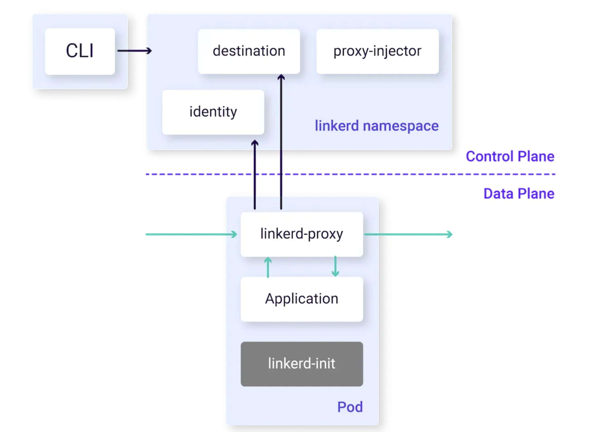

# Linkerd Demo on Minikube

This README will walk you through installing and using [Linkerd](https://linkerd.io/) on a local Kubernetes cluster provisioned with [Minikube](https://minikube.sigs.k8s.io/docs/). By the end of this demo, you’ll have:

- A running **Minikube** cluster
- The **Linkerd** control plane installed and running
- The **Linkerd CLI** for command-line interactions
- **Linkerd Viz** (on-cluster metrics stack)
- Optionally, **Buoyant Cloud** (a hosted metric stack and monitoring service)
- The **emojivoto** demo application instrumented with the Linkerd sidecar proxies

---

## Prerequisites

- A Linux machine (or a compatible environment) with:
  - [cURL](https://curl.se/)
  - [Docker](https://docs.docker.com/get-docker/) installed and running
  - [kubectl](https://kubernetes.io/docs/tasks/tools/) installed
  - [Minikube](https://minikube.sigs.k8s.io/docs/start/) installed




---

## 1. Install the Linkerd CLI

The Linkerd CLI allows you to interact with Linkerd services on your cluster.

```bash
curl -sL run.linkerd.io/install | sh
```
---

## 1.1 Add the Linkerd CLI to your PATH

```bash
export PATH=$PATH:/home/<system-username>/linkerd2/bin
```


## 1.2. Start the minikube cluster

```bash
minikube start --cpus 4 --memory 4096
```

## 1.3. Install Linkerd(including CRD's)
Before installing linkerd you might have to install CRD's run 
```bash
linkerd install --crds | kubectl apply -f -
```
Linkerd generates the Custom Resource Definitions (CRDs) needed for its operation and pipes them into kubectl apply. These CRDs define the Linkerd-specific resource types (like LinkerdConfig, ServiceProfiles, etc.) that Kubernetes needs to recognize before you install the rest of the Linkerd control plane. Once applied, your cluster will have the necessary definitions in place for Linkerd to function properly.

Now install linkerd control plane on minikube cluster 

```bash
linkerd install | kubectl apply -f -
```

This linkerd install command generates Kubernetes manifest files (which include the core Linkerd control plane components such as the Controller, Identity, Destination, etc.). By piping (|) this output to kubectl apply -f -, you instruct Kubernetes to create (or update) those resources in your cluster. Essentially, this step installs the main Linkerd control plane once the CRDs (from the previous step using --crds) are already in place.

## 1.4. Check Linkerd is installed properly 


