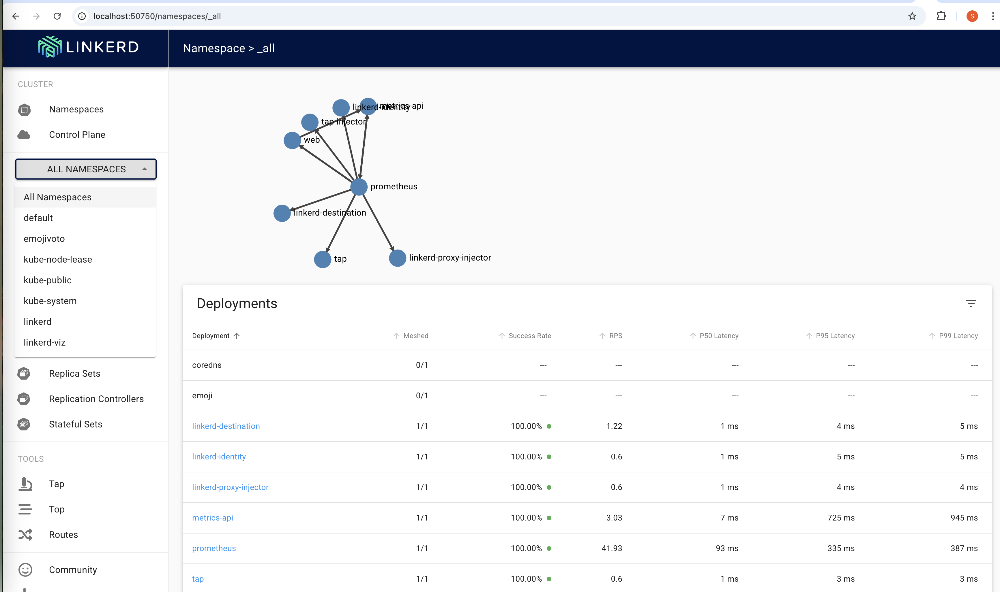

# Linkerd Demo on Minikube

This README will walk you through installing and using [Linkerd](https://linkerd.io/) on a local Kubernetes cluster provisioned with [Minikube](https://minikube.sigs.k8s.io/docs/). By the end of this demo, you’ll have:

- A running **Minikube** cluster
- The **Linkerd** control plane installed and running
- The **Linkerd CLI** for command-line interactions
- **Linkerd Viz** (on-cluster metrics stack)
- Optionally, **Buoyant Cloud** (a hosted metric stack and monitoring service)
- The **emojivoto** demo application instrumented with the Linkerd sidecar proxies

---

## Prerequisites

- A Linux machine (or a compatible environment) with:
  - [cURL](https://curl.se/)
  - [Docker](https://docs.docker.com/get-docker/) installed and running
  - [kubectl](https://kubernetes.io/docs/tasks/tools/) installed
  - [Minikube](https://minikube.sigs.k8s.io/docs/start/) installed


---

## 1. Install the Linkerd CLI

The Linkerd CLI allows you to interact with Linkerd services on your cluster.

```bash
curl -sL run.linkerd.io/install | sh
```
---

## 1.1 Add the Linkerd CLI to your PATH

```bash
export PATH=$PATH:/home/<system-username>/linkerd2/bin
```


## 1.2. Start the minikube cluster

```bash
minikube start --cpus 4 --memory 4096
```

## 1.3. Install Linkerd(including CRD's)
Before installing linkerd you might have to install CRD's run 
```bash
linkerd install --crds | kubectl apply -f -
```
Linkerd generates the Custom Resource Definitions (CRDs) needed for its operation and pipes them into kubectl apply. These CRDs define the Linkerd-specific resource types (like LinkerdConfig, ServiceProfiles, etc.) that Kubernetes needs to recognize before you install the rest of the Linkerd control plane. Once applied, your cluster will have the necessary definitions in place for Linkerd to function properly.

Now install linkerd control plane on minikube cluster 

```bash
linkerd install | kubectl apply -f -
```

This linkerd install command generates Kubernetes manifest files (which include the core Linkerd control plane components such as the Controller, Identity, Destination, etc.). By piping (|) this output to kubectl apply -f -, you instruct Kubernetes to create (or update) those resources in your cluster. Essentially, this step installs the main Linkerd control plane once the CRDs (from the previous step using --crds) are already in place.

## 1.4. Check Linkerd is installed properly 

```bash
linkerd check
```
## 1.4. Install viz for observalility 

The Linkerd Viz extension provides the observability stack (Prometheus, Grafana, etc.) and a dashboard for visualizing Linkerd’s metrics. While you can run Linkerd without it, you won’t have built-in visibility into your services’ traffic. By installing Viz, you get:

Prometheus – to scrape and store service mesh metrics (latency, success rate, request volume).
Grafana – to visualize those metrics in customizable dashboards.
Web-based Dashboard – a user interface for real-time inspection of traffic stats, mesh components, and debugging.

```bash
linkerd viz install | kubectl apply -f -
```


## 1.5. View the viz dashboard 

View the cluster metrics in the ui. 
```bash
linkerd viz dashboard &
```




## 1.5. Deploy a sample application and inject side car proxy 

In Linkerd (and most service meshes), the sidecar is a proxy container that runs alongside your main application container within the same pod. This sidecar proxy intercepts all inbound and outbound traffic for that application.


```bash
curl -sL run.linkerd.io/emojivoto.yml | kubectl apply -f -
```

Check the application is up and running by port forwading 

```bash
kubectl -n emojivoto port-forward svc/web-svc 8080:80
```


- The sidecar proxy in Linkerd seamlessly manages traffic (routing, retries, timeouts), collects observability metrics (latency, success rate), and enforces mTLS for secure communication—all without requiring changes to application code.
- This separation of concerns allows developers to focus on their business logic while Linkerd handles routing, logging, and security.


- Inject the sidecar container into the application

```bash
curl -sL run.linkerd.io/emojivoto.yml | linkerd inject - | kubectl apply -f -
```

